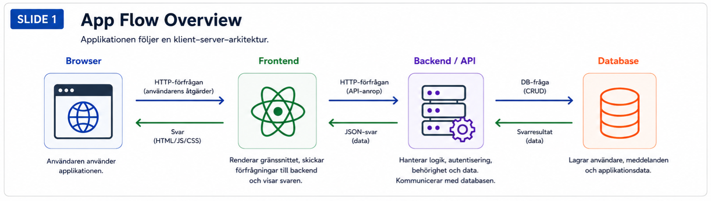
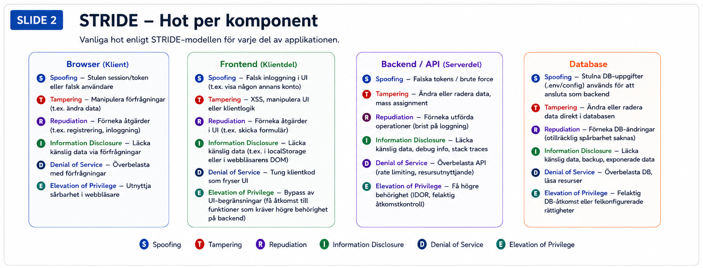

# Säker systemutveckling

Det här projektet är en del av kursen Säker systemutveckling och bygger på en redan existerande fullstack-applikation för meddelanden som finns på GitHub.
Applikationen låter användaren:

Skapa ett konto
Logga in
Skapa meddelanden
Redigera meddelanden
Ta bort meddelanden

Syftet med projektet är inte att bygga en helt ny applikation från grunden, utan istället att analysera och förstå en existerande applikation ur ett säkerhetsperspektiv.
Uppgiften är uppdelad i tre faser:

1.Planering
2.Kodförståelse
3.Säkerhetsgranskning

# Phase 1 – Planning

## App Flow Overview

Den här sliden visar hur applikationen är uppbyggd och hur data rör sig genom systemet. Användaren interagerar med applikationen genom browsern, frontend skickar requests till backend/API och backend kommunicerar med databasen. Att förstå app flow hjälper till att identifiera var säkerhetshot och sårbarheter kan uppstå.

## STRIDE Threat Modeling

Den här sliden visar möjliga hot i olika delar av applikationen med hjälp av STRIDE-modellen. Syftet är att identifiera vanliga säkerhetsrisker som spoofing, tampering, information disclosure och elevation of privilege. Threat modeling hjälper till att koppla säkerhetsrisker till specifika delar av systemarkitekturen.
Jag valde att applicera STRIDE på applikationens komponenter istället för direkt på dataflödena, för att göra hotmodellen tydligare och enklare att följa.

# App Flow Overview

Den här sliden kopplar identifierade hot till konkreta säkerhetskrav. Målet är att minska risker genom att definiera hur applikationen ska hantera authentication, authorization, input validation, password security och dependency management. Säkerhetskraven är baserade på de hot som identifierades under planeringsfasen.
